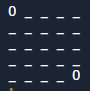
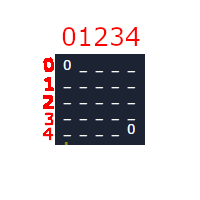
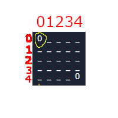
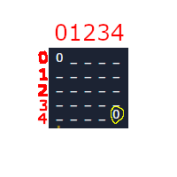
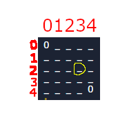

# Intro to Python
  Welcome to the introduction to Python. Previously you worked on JS. JS and Python have many similarities but where they differ is mostly where we use it. JS is mostly used for websites and smartphone apps. Python is used for everything else, such as, AI, robotics and research.  

  It is assumed that you already have some programming knowledge from JS so some of the strict definition will not be explained here. If you need those details please refer back to the JS unit.

  To begin any programming language you must start with the classic `Hello World`. Whenever you see `#` in your coding examples that means comment. The line of code will be explained to the right of this symbol.
  
```python
print("Hello World") # print() is a build-in function that displays a message to the console
```

## Task 1
In main.py `print` Hello (enter your name here). Example `Hello Steve` if your name is Steve
#

Now lets declare some variables and then print them

```python
number = 23 //type of number
container = "Sean Combs" //type of string
cat = False //type of boolean

print(number)
print(container)
print(cat)
```
## Task 2
Assign your variables `box, letters, dog` the number, string and boolean `91, "Biggy", True`. Now `print` each of the variables
##

As the name suggests `variables` can change. When you want to change a variable you call it `variable reassignment`

## Task 3
1. `reassign` the 3 variables
2. print() the three variables.
##

You have now learned the very basics of Python, of course there is more to learn such as `loops` and `functions` but they are similar to JS and you will cover them later.

For now you need to get onto Python and computer graphics.

# Pixels
At the heart of computer graphics is the pixel.  It is a location on a screen which will light up in some color based on commands.  You are going to represent a simple screen with a 5x5 matrix shown below.



This matrix is really a `data structure` known as `2d list`. To modify this matrix or change the pixel status, you need to call the address you want to modify.

The matrix is layed out like this.


matrix[0][0] = 

matrix[4][4] = 

matrix[2][3] = 

Another way to put this would be matrix[row][column]

A `_` means that pixel is off and a `0` means the the pixel is on. So to turn on pixel 2,3 we need to do the following.

```python
matrix[2][3] = 0 #changed the data stored in 2,3 to 0
print_matrix(matrix) # displaying the current matrix 
```

## Task 4
1. Make code that will create a large `+` symbol on your matrix
2. display the matrix with the pre-made `print_matrix()` function
##

Like JS, Python also has functions and loops

```python
def print_matrix(matrix): #def tell the computer that this is a function. `matrix` is the name of the parameter 
  for row in matrix: #the for loop will go through each row in the matrix
    print(' '.join(map(str,row)))

matrix[2][1] = "_" #this line is not part of the print_matrix function because it is not indented like everything above it
```

As you can see functions are very similar to JS but with a few differences. Now we have `:` and no `{}`. That is because Python does not use`{}` to determine the beginning and end of a funcion or block. It uses `:` and `indent spaces`. Everything that is indented under the function is part of the function. That is until something is no long indented, like `matrix[2][1] = "_"`. This is the end of the function.

## Task 5
1. Make a function that will generate a triangle, choose whatever size you like, display the matrix
2. Make a function that turns all the pixels off or to `_` and displays the matrix
3. Call each function 1 time. `Remember you should probably clear or remake the old matrix first`
##

The structure of `for` in python is slightly different. Of course it uses the `"` and `indent` as the function does. But instead of `for(int i = 0; i<10; i++)` you use:

```python
for counter in range(10):
  print(counter)
  ```

## Task 6
1. Use a for loop to display a blank matrix and a matrix with a triangle on it, repeated 5 times.
##

## Task 7
1. Navagate to https://makecode.microbit.org/#
2. Use a function and a for loop to create a rectangle of any size in the microbit matrix
3. If you have a microbit download it to the device and show your teacher. If you don't just use the provided simulator
4. Attach your code to the bottem of main.py
5. Comment out the attached code as it will not work in the replit editor.
##